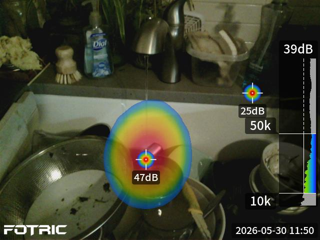

# FOTRIC TD2e Acoustic Imager

*Documentation of the STUDIO's Fotric TD2e Acoustic Imager (part of the Experimental Capture equipment resource)*

* [**USER MANUAL PDF**](fotric_tdxe_user_manual_v1.0_20260410.pdf)
* [Manufacturer site](https://www.fotric.com/post/fotric-td2e-kit-acoustic-imaging-camera-leak-detection)
* [Product page](https://www.fotric.com/td2e-acoustic-imaging-camera)

---

YouTube videos: 

* [See Sound. Discover How the FOTRIC TD2 Spots Invisible Leaks](https://www.youtube.com/watch?v=esTjHiBkcEs&t)
* [Testing Fotric Acoustic Camera To See Sound](https://www.youtube.com/watch?v=d6tReONGevs)